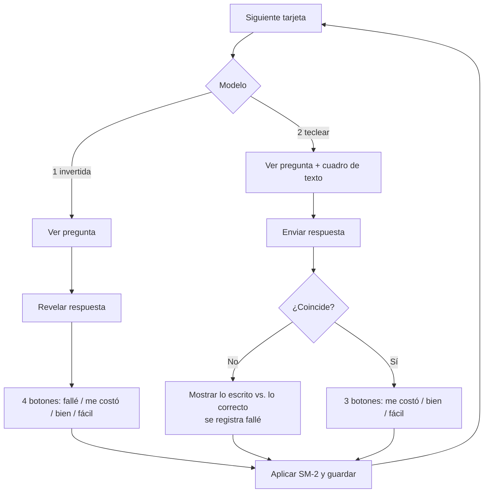

# Diseño spaced-repetition-app

Resumen técnico de la solución a [SPEC.md](SPEC.md). Los casos de prueba acordados están en [TEST-PLAN.md](TEST-PLAN.md).

## Resumen

- Aplicación web local en Python + Flask, para un único usuario.
- `run.py` arranca el servidor en `127.0.0.1:5000` y abre el navegador.
- Datos en dos ficheros: `data/cards.tsv` (contenido, compatible con Anki) y `data/progress.json` (progreso, local y fuera de git).
- Planificación con SM-2, con un intervalo máximo de 21 días.
- Pantallas: repaso, progreso, ayuda (se abre sola la primera vez) y estudio libre (no cuenta para el calendario).
- Imágenes de fondo descargadas desde Wikimedia Commons con un script.

## Componentes

| Fichero | Responsabilidad |
| --- | --- |
| `run.py` | Arranca el servidor, abre el navegador y espera la orden de parada |
| `app/__init__.py` | Crea la app Flask |
| `app/config.py` | Constantes ajustables (ver [Parámetros](#parámetros)) |
| `app/routes.py` | Pantallas y acciones: repaso, progreso, ayuda, estudio libre, cerrar |
| `app/storage.py` | Lee `cards.tsv`; lee y escribe `progress.json` |
| `app/planner.py` | Decide la siguiente tarjeta de la sesión y el orden del estudio libre |
| `app/scheduler.py` | Aplica SM-2 a una puntuación |
| `app/checker.py` | Compara la respuesta tecleada con tolerancia |
| `app/stats.py` | Calcula los grupos de progreso y lo que falta para acabar |
| `app/templates/` | `base.html`, `review.html`, `done.html`, `progress.html`, `help.html`, `goodbye.html` |
| `app/static/` | CSS, JS mínimo (revelar respuesta) e imágenes descargadas |
| `scripts/fetch_images.py` | Busca y descarga una imagen de Wikimedia para una nota |
| `data/image-credits.md` | Autoría y licencia de cada imagen |

## Datos

### Contenido: `data/cards.tsv`

Una fila por **nota**, con columnas separadas por tabuladores (`⇥` en el ejemplo). La cabecera sigue el formato de importación de texto de Anki:

```text
#separator:tab
#html:false
#guid column:1
#notetype column:2
#columns:id⇥model⇥front⇥back⇥alternatives⇥image
dog⇥Basic (and reversed card)⇥Dog⇥Perro⇥⇥dog.jpg
boe⇥Basic (type in the answer)⇥¿Qué significa BOE?⇥Boletín Oficial del Estado⇥Boletín Oficial⇥boe.jpg
```

| Columna | Contenido |
| --- | --- |
| `id` | Identificador de la nota (ver [Formato del id](#formato-del-id)). También es el `guid` para Anki |
| `model` | `Basic (and reversed card)` o `Basic (type in the answer)`, con los mismos nombres que usa Anki |
| `front` | Pregunta |
| `back` | Respuesta |
| `alternatives` | Solo modelo 2: otras respuestas válidas, separadas por `\|`. Puede quedar vacía |
| `image` | Nombre del fichero en `app/static/images/`. Puede quedar vacía |

Tarjetas que salen de cada nota:

- Modelo 1 (invertida): dos tarjetas, `<id>:forward` (front → back) y `<id>:reverse` (back → front).
- Modelo 2 (teclear): una tarjeta, `<id>`, en una sola dirección (front → back).

El orden de las filas es el orden de creación, que decide en qué orden salen las tarjetas nuevas. Los dos modelos se mezclan según ese orden.

### Formato del id

Cadena corta que identifica la nota. La escribe a mano quien crea la nota.

- **Formato:** kebab-case con minúsculas ASCII y dígitos: una o más palabras separadas por un solo `-`, de 1 a 40 caracteres. Expresión regular: `^[a-z0-9]+(-[a-z0-9]+)*$`.
  - Válidos: `dog`, `boe`, `dog-verb`, `capital-france`, `onu-2`.
  - No válidos: `Dog` (mayúscula), `tengo una casa` (espacios), `árbol` (tilde), `dog_verb` (guion bajo), `-dog` o `dog--verb` (guion mal colocado).
- **Único** en todo `cards.tsv`. Si se repite un concepto, se distingue en el id: `dog` y `dog-verb`.
- **Inmutable:** no se cambia una vez creado, porque el progreso y la imagen se asocian a él. Corregir la pregunta o la respuesta no afecta al id.
- **Uso:** identifica las tarjetas en `progress.json` (`dog:forward`), da nombre a la imagen (`dog.jpg`) y es el argumento de `fetch_images.py`.
- **Validación:** al arrancar, la app y `fetch_images.py` comprueban el formato y los duplicados. Si hay un error, no continúan y muestran la línea afectada, por ejemplo: `cards.tsv línea 12: id duplicado "dog" (ya usado en la línea 6)`.

### Progreso: `data/progress.json`

Solo lo escribe la app. Si no existe, se crea en la primera puntuación. Está en `.gitignore`.

```json
{
  "cards": {
    "dog:forward": {
      "reps": 2,
      "interval_days": 3,
      "ease": 2.5,
      "lapses": 0,
      "due": "2026-09-27T00:00:00",
      "first_seen": "2026-09-24",
      "last_review": "2026-09-24T18:02:11"
    }
  }
}
```

- Si una tarjeta no aparece en `cards`, es nueva.
- Se guarda **en cada puntuación**, con escritura atómica (fichero temporal + `os.replace`). Cerrar en cualquier momento no pierde nada.
- Las horas son locales.
- Cada formulario de puntuación lleva oculto el `last_review` que tenía la tarjeta al mostrarse (vacío si es nueva). Si al puntuar no coincide con el guardado, la pantalla estaba desfasada (doble clic, botón "Atrás" o recarga) y la puntuación se ignora. Así una misma respuesta nunca cuenta dos veces.

## Flujo de repaso



- Modelo 1: la respuesta se revela en el navegador (JS), sin petición al servidor.
- Modelo 2: la respuesta se envía al servidor y `checker.py` la compara. Si falla, la puntuación "fallé" se aplica sin preguntar y se muestra un botón "Continuar".

## Comparación de la respuesta tecleada

Acierto si la respuesta normalizada coincide con `back` o con alguna de las `alternatives` normalizadas.

Normalización:

1. Mayúsculas y minúsculas se igualan (`casefold`).
2. Se quitan los espacios del principio y del final, y los espacios repetidos se reducen a uno.
3. Se quita un punto final.
4. Se quitan las tildes y diéresis (`á é í ó ú à è ü` …). La `ñ` se conserva: `España` ≠ `Espana`.

No se toleran letras cambiadas o que faltan, palabras distintas ni un orden diferente. Para aceptar otra forma, se añade como alternativa en la nota.

Las variantes habituales de un nombre largo se añaden como alternativas al crear la nota. Por ejemplo, sin las palabras de enlace: `Organización Naciones Unidas` para `Organización de las Naciones Unidas`.

## Planificación: SM-2

Estado por tarjeta: `reps` (aciertos seguidos), `interval_days`, `ease` (inicial 2,5; mínimo 1,3) y `lapses`.

Primero se actualiza `ease` y después se calcula el intervalo. Los intervalos en días se redondean hacia arriba y **nunca superan `MAX_INTERVAL_DAYS` (21)**: una tarjeta no pasa más de 21 días sin salir, aunque la fórmula dé más.

| Puntuación | `ease` | Siguiente repaso | `reps` |
| --- | --- | --- | --- |
| Fallé | −0,20 | +10 minutos | 0 (y `lapses` +1) |
| Me costó | −0,15 | `reps` = 0: 1 día. Si no: `max(interval + 1, interval × 1,2)` | +1 |
| Bien | = | `reps` = 0: 1 día. `reps` = 1: 3 días. Si no: `interval × ease` | +1 |
| Fácil | +0,15 | `reps` = 0: 4 días. Si no: `interval × ease × 1,3` | +1 |

Ejemplo con una tarjeta nueva: bien → 1 día, bien → 3 días, bien → 8 días, fácil → 21 días (la fórmula daría 28; se aplica el tope), bien → 21 días.

Los repasos en días vencen a las 00:00 del día que toca, así la tarjeta está disponible todo el día. Los de 10 minutos vencen a la hora exacta.

### Alternativa descartada: FSRS

FSRS es el algoritmo que usa Anki actualmente. Predice la probabilidad de recordar con un modelo de memoria de varios parámetros, que se ajustan con el historial de repasos.

Se descarta en esta versión por estos motivos:

- Necesita una librería externa y un historial de repasos para ajustar los parámetros.
- Sus intervalos no se pueden calcular a mano, así que no sirven para acordar casos de prueba con ejemplos simples.
- Para el volumen de tarjetas de un uso personal, la mejora de precisión no compensa la complejidad.

Si se adopta en el futuro, el cambio queda dentro de `scheduler.py`. `progress.json` tendría que guardar además el historial de repasos de cada tarjeta.

## Orden de la sesión

`planner.py` elige la siguiente tarjeta con este orden:

1. **Falladas hoy cuyos 10 minutos ya se han cumplido.** Pasan por delante de todo para que vuelvan a tiempo, intercaladas con las demás.
2. **Repasos vencidos** (`due` ≤ ahora), del más atrasado al más reciente. Incluye las falladas en días anteriores.
3. **Nuevas**, en el orden de `cards.tsv`, hasta `NEW_CARDS_PER_DAY` al día. Se cuentan las tarjetas cuyo `first_seen` es hoy.
4. **Falladas hoy que aún esperan sus 10 minutos**, solo si no queda nada más: se muestra antes de tiempo la que venza primero.
5. Si no queda nada: pantalla "Has terminado por hoy" con la fecha del próximo repaso.

Tarjetas hermanas: las dos tarjetas de una nota del modelo 1 no se muestran el mismo día. Si una ya se ha respondido hoy, la otra no se muestra hasta otro día. Como el intervalo de la primera crece, la segunda sale el primer día en que la primera no vence.

## Navegación

Barra superior en todas las pantallas: **Estudiar** · **Progreso** · **Ayuda** · **Estudio libre** · **Ya vale por hoy**.

| Ruta | Pantalla |
| --- | --- |
| `GET /` | Entrada. Si no existe `progress.json`, redirige a `/help`; si existe, a `/study` |
| `GET /study` | Repaso: siguiente tarjeta o "Has terminado por hoy" |
| `POST /answer/<card_id>`, `POST /rate/<card_id>` | Comprobar la respuesta tecleada y puntuar |
| `GET /progress` | Progreso |
| `GET /help` | Manual de ayuda, con botón "Empezar" que lleva a `/study` |
| `GET /free/start` | Baraja todas las tarjetas y empieza un estudio libre |
| `GET /free`, `POST /free/answer/<card_id>`, `POST /free/next` | Tarjeta actual, comprobar respuesta tecleada y pasar a la siguiente del estudio libre |
| `POST /quit` | Ya vale por hoy |

## Pantalla de progreso

Resumen del mazo sin nombres de tarjetas. Se calcula en `stats.py` a partir de `progress.json`.

Cada **tarjeta** (no cada nota) pertenece a un grupo según su intervalo actual:

| Grupo | Criterio |
| --- | --- |
| **No la sé** | Nunca estudiada, o intervalo menor que `MEDIUM_FROM_DAYS` (3 días). Incluye las recién falladas |
| **Medio** | Intervalo de 3 a 20 días |
| **Buen progreso** | Intervalo igual al tope (`MAX_INTERVAL_DAYS`, 21 días) |

"Acabar" una tarjeta es llevarla a buen progreso. La pantalla muestra:

- El número de tarjetas de cada grupo, con una barra proporcional.
- **Respuestas que faltan:** para cada tarjeta, se simulan respuestas "Bien" con SM-2 hasta llegar al tope, y se suman. Una tarjeta nueva necesita 5 (intervalos 1, 3, 8, 20 y 21).
- **Días que faltan:** en esa misma simulación, el día en que cada tarjeta recibe su última respuesta. Se toma el máximo. La simulación parte de la fecha de repaso de cada tarjeta (hoy, si está atrasada). Las nuevas empiezan según el límite diario: la tarjeta nueva número *i* (desde 0) empieza el día `i // NEW_CARDS_PER_DAY`. No se tiene en cuenta la regla de tarjetas hermanas.
- La advertencia de que es un mínimo: cada fallo añade respuestas y días.

Ejemplo, con 10 tarjetas: 2 en buen progreso, 3 en medio (intervalo 8) y 5 nuevas.

> Buen progreso **2** · Medio **3** · No las sé **5**
>
> Para acabar las 10 te faltan **al menos 31 respuestas**, repartidas en **unos 32 días**. Si fallas alguna, serán más.

## Manual de ayuda

`help.html`, en español y en lenguaje no técnico. Contenido:

1. Qué es la repetición espaciada y por qué se estudia **repartido en días**: recordar algo justo cuando empieza a olvidarse lo refuerza. Repetirlo varias veces el mismo día no.
2. Cómo es un repaso en cada modelo y qué significa cada botón.
3. Cómo cambia la fecha de una tarjeta, con el ejemplo de "Dog" (1, 3, 8, 20 y 21 días) y el tope de 21 días.
4. Qué pasa si no se abre la app varios días: nada se pierde; las atrasadas salen primero.
5. Cuándo parar: si la app muestra una tarjeta, toca; si muestra "Has terminado por hoy", se puede parar.
6. Cómo leer la pantalla de progreso.
7. Para qué sirve el estudio libre y por qué no cuenta.

Se abre sola mientras no exista `progress.json` (es decir, hasta la primera puntuación). Después, solo desde el enlace "Ayuda".

## Estudio libre

Repaso de todas las tarjetas cuando se quiera, por ejemplo antes de un examen. **No modifica `progress.json`**: no cuenta para el calendario ni para el progreso.

- Incluye todas las tarjetas, también las nuevas y las dos direcciones del modelo 1, **en orden aleatorio**. No se aplica la regla de tarjetas hermanas.
- Misma pantalla que el repaso (`review.html`), con un aviso fijo: "Estudio libre: no cuenta para tu progreso".
- Modelo 1: revelar la respuesta → botón **Siguiente**. Modelo 2: escribir → se muestra si coincide (misma comparación que en el repaso) → botón **Siguiente**. No hay botones de puntuación.
- El orden barajado y la posición se guardan en la sesión de Flask (cookie), no en disco. Cada arranque de la app empieza sin estudio libre en curso.
- Al terminar: "Has repasado N tarjetas" y un enlace para volver a Estudiar.

## Imágenes

- Fuente: API de Wikimedia Commons (`commons.wikimedia.org/w/api.php`). Es pública, no pide registro ni clave, y sus imágenes tienen licencia libre. Las peticiones llevan una cabecera `User-Agent` identificativa, como exige Wikimedia.
- Uso: `python scripts/fetch_images.py <id> "<término de búsqueda>"`. El script:
  1. Busca el término en el espacio de ficheros de Commons y toma el primer resultado de tipo imagen.
  2. Descarga la versión de 800 px de ancho en `app/static/images/<id>.jpg`.
  3. Escribe el nombre del fichero en la columna `image` de la nota.
  4. Añade autor, licencia y URL de origen a `data/image-credits.md`.
- Las imágenes se guardan en el repositorio, así que la app funciona sin conexión.
- Si una nota no tiene imagen, se usa un fondo neutro.
- Los datos de ejemplo se generan con este script.

## Compatibilidad con Anki

- `cards.tsv` se importa en Anki con *Archivo → Importar*. Las columnas `model` e `id` indican el tipo de nota y el identificador, así que al reimportar se actualiza en lugar de duplicar.
- Anki usa `front` y `back`. Las columnas `alternatives` e `image` no tienen equivalente en los tipos de nota estándar y se ignoran al asignar los campos.
- No se exporta el progreso: Anki no importa calendarios desde texto.

## Arranque y cierre

- `run.py` valida `cards.tsv` (si hay un error, no arranca y muestra la línea), crea un servidor `werkzeug` (`make_server`), abre `http://127.0.0.1:5000` con `webbrowser` y atiende peticiones hasta recibir la orden de parada.
- `--no-browser` arranca sin abrir el navegador. Si el puerto está ocupado (por ejemplo, porque la app ya está abierta en otra terminal), se indica y no arranca.
- El botón "Ya vale por hoy" (`POST /quit`) devuelve la pantalla "Hasta mañana" y después detiene el servidor, con lo que termina el script. Como no hay nada pendiente de guardar, el cierre es inmediato.
- La pestaña del navegador la cierra el usuario: un navegador no permite cerrar por código una pestaña que no abrió un script.

## Parámetros

En `app/config.py`:

| Constante | Valor |
| --- | --- |
| `NEW_CARDS_PER_DAY` | 10 |
| `RELEARN_MINUTES` | 10 |
| `MAX_INTERVAL_DAYS` | 21 (tope de intervalo y límite de "buen progreso") |
| `MEDIUM_FROM_DAYS` | 3 (límite entre "no la sé" y "medio") |
| `HOST` / `PORT` | `127.0.0.1` / `5000` |

## Evoluciones futuras

- Cambiar SM-2 por FSRS (ver [Alternativa descartada: FSRS](#alternativa-descartada-fsrs)).
- Ignorar las palabras de enlace (`de`, `del`, `la`, `las`, `el`, `los`, `y`) al comparar la respuesta tecleada, para no tener que escribir como alternativas las variantes que solo se diferencian en ellas. Ahora se escriben en cada nota.
- Campo `strict` por nota, para que las tildes cuenten cuando cambian el significado (`papa` / `papá`). Ahora esos casos no se distinguen.
